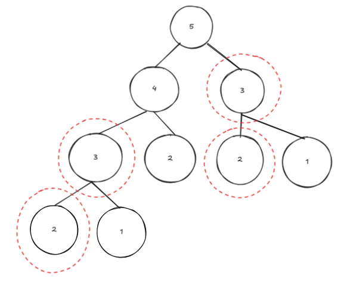
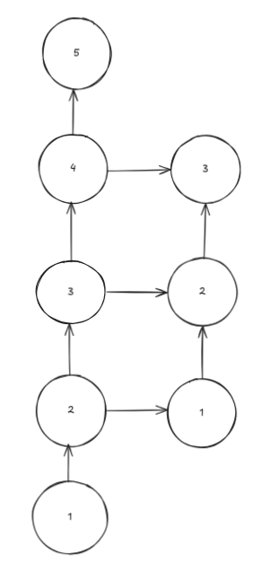

# Grado de subproblemas

En este tipo de problemas en donde se puede aplicar la programación dinámica, se puede observar una *superposición de subproblemas*. Con esto se hace referencia a que el problema principal se puede descomponer en varios subproblemas más pequeños y estos subproblemas se repiten varias veces en diferentes partes del cálculo.

Viendolo para la secuencia de Fibonacci calculando el quinto número de esta sucesión obtendriamos el siguiente árbol de recursión:

(Se puede ver que los subproblemas para el segundo y tecer número de la sucesión se repiten)

Para evitar el calculo de subproblemas innecesarios podemos hacer una representación de los subproblemas como un grafo:

